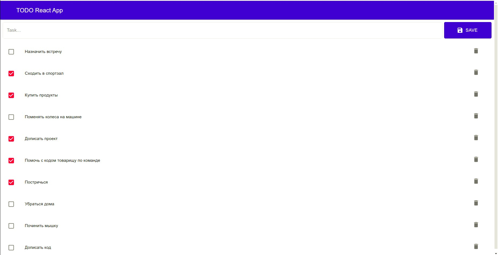

# ***TODO*** 

### Имеются возможности добавления, изменения статуса и удаления задач:

### Установка и запуск приложения:
> В папке front команда yarn, затем yarn start  
> В папке back команда npm i, затем npm start

### Планы развития приложения:
* Добавление авторизации
* Добавление возможности редактирования задач

### Использованные технологии:
* React
* Redux
* Redux-Thunk
* Redux-Saga
* Material UI
* Node
* Express
* MongoDB
* Mongoose
